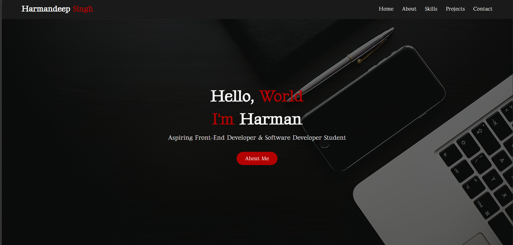

# Harmandeep Singh - Portfolio Website

## Description
This is my personal portfolio website built using HTML and CSS. It showcases my background, skills, and projects as an aspiring Full-Stack Developer. The website is designed to present my work in a clean, modern, and user-friendly way.

## Tech Stack
- HTML5  
- CSS3  
- Google Fonts  

## Features
- Responsive portfolio layout  
- Navigation with multiple sections (Home, About, Skills, Projects, Contact)  
- Clean and modern UI design  
- Project showcase section  
- Contact section with email, LinkedIn, and GitHub links  

## Screenshot

## Contact
- Email: rataulharmandeep@gmail.com  
- LinkedIn: https://www.linkedin.com/in/harmandeep-singh-20727a333  

## About Me
I am an aspiring Full-Stack Developer currently studying at MITT. I have a background in Business Administration and enjoy building modern, user-friendly web applications. I am passionate about learning new technologies and improving my development skills.

## Live Demo
https://rataulharman.github.io/my_portfolio/

## Thanks for visiting my profile.